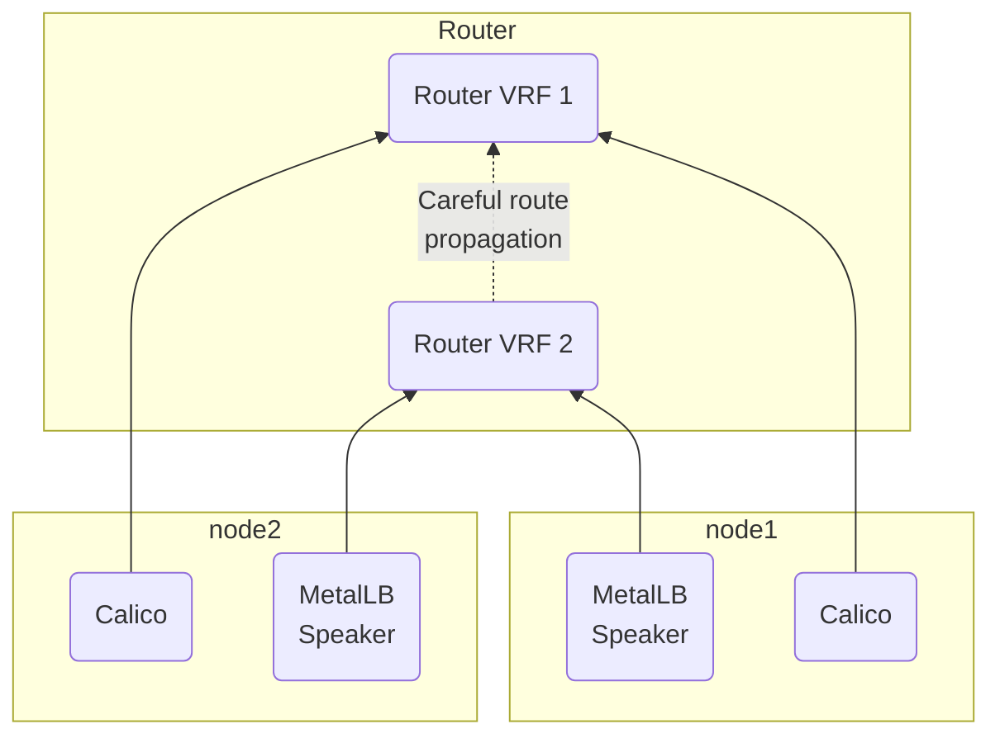
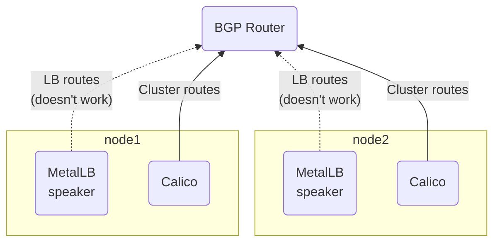
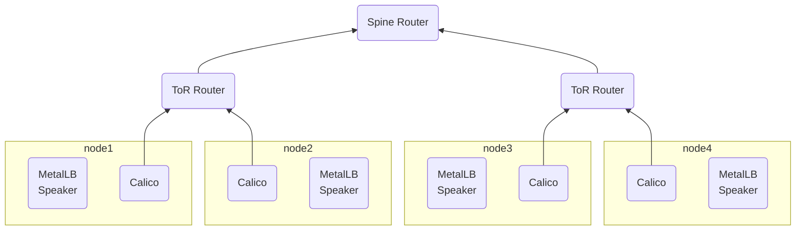
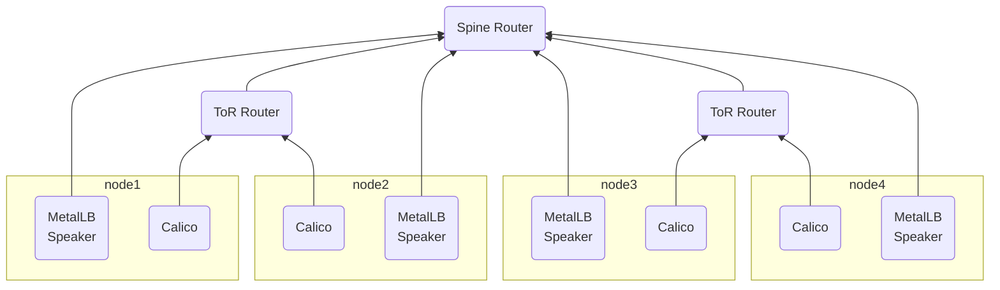
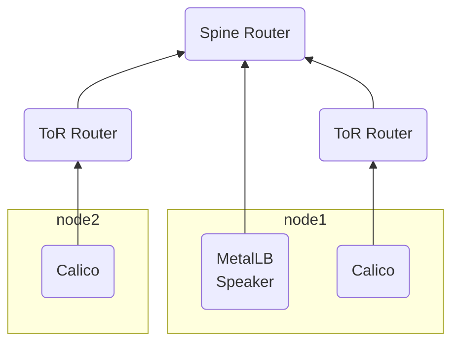

# MetalLB-v0.8.1-官方文档阅读笔记


> 参考：  
> <https://metallb.universe.tf/>  
> <https://github.com/danderson/metallb>

## Introduction

MetalLB is a load-balancer implementation for bare metal [Kubernetes](https://kubernetes.io/) clusters, using standard routing protocols.

> MetalLB is a young project. You should treat it as a **beta** system. The [project maturity(项目进度)](https://metallb.universe.tf/concepts/maturity/) page explains what that implies.

**Why?**  
Kubernetes does not offer an implementation of network load-balancers ([Services of type LoadBalancer](https://kubernetes.io/docs/tasks/access-application-cluster/create-external-load-balancer/)) for bare metal clusters. The implementations of Network LB that Kubernetes does ship with are all glue code that calls out to various IaaS platforms(Kubernetes随附的Network LB的实现都是调用各种IaaS平台的粘合代码) (GCP, AWS, Azure…). If you’re not running on a supported IaaS platform (GCP, AWS, Azure…), LoadBalancers will remain in the “pending” state indefinitely when created.

Bare metal cluster operators are left with two lesser tools to bring user traffic into their clusters, “NodePort” and “externalIPs” services. Both of these options have significant(重大的) downsides(缺点) for production use, which makes bare metal clusters second class citizens(公民) in the Kubernetes ecosystem(生态系统).

MetalLB aims to redress(纠正) this imbalance(不平衡) by offering a Network LB implementation that integrates(整合) with standard network equipment, so that external services on bare metal clusters also “just work” as much as possible.

**Requirements**
MetalLB requires the following to function:

- A [Kubernetes](https://kubernetes.io/) cluster, running Kubernetes 1.13.0 or later, that does not already have network load-balancing functionality.
- A [cluster network configuration](https://metallb.universe.tf/installation/network-addons/) that can coexist(共存) with MetalLB.
- Some IPv4 addresses for MetalLB to hand out.
- Depending on the operating mode, you may need one or more routers capable of speaking [BGP](https://en.wikipedia.org/wiki/Border_Gateway_Protocol).

**Usage**
The [concepts](https://metallb.universe.tf/concepts/) section will give you a primer on what MetalLB does in your cluster. When you’re ready to deploy to a Kubernetes cluster, head to the [installation](https://metallb.universe.tf/installation/) and [usage](https://metallb.universe.tf/usage/) guides.

## Concepts

MetalLB hooks into(钩入) your Kubernetes cluster, and provides a network load-balancer implementation. In short, it allows you to create Kubernetes services of type "LoadBalancer" in clusters that don't run on a cloud provider, and thus cannot simply hook into(使用) paid products(付费产品) to provide load-balancers.

It has two features that work together to provide this service: address allocation(地址分配), and external announcement(外部公告).

### Address allocation

In a cloud-enabled Kubernetes cluster, you request a load-balancer, and your cloud platform assigns an IP address to you. In a bare metal cluster, MetalLB is responsible for that allocation.

MetalLB cannot create IP addresses out of thin air(凭空), so you do have to give it _pools_ of IP addresses that it can use. MetalLB will take care of assigning and unassigning individual addresses as services come and go, but it will only ever hand out IPs that are part of its configured pools.

How you get IP address pools for MetalLB depends on your environment. If you're running a bare metal cluster in a colocation facility(代管设施), your hosting provider probably offers IP addresses for lease(出租). In that case, you would lease, say, a /26 of IP space (64 addresses), and provide that range to MetalLB for cluster services.

Alternatively, your cluster might be purely private, providing services to a nearby LAN but not exposed to the internet. In that case, you could pick a range of IPs from one of the private adress spaces (so-called RFC1918 addresses), and assign those to MetalLB. Such addresses are free, and work fine as long as you're only providing cluster services to your LAN(这样的地址是免费的，并且只要您仅向局域网提供群集服务就可以正常工作).

Or, you could do both! MetalLB lets you define as many address pools as you want, and doesn't care what "kind" of addresses you give it.

### External announcement

Once MetalLB has assigned an external IP address to a service, it needs to make the network beyond the cluster aware that the IP "lives" in the cluster. MetalLB uses standard routing protocols to achieve this: **ARP**, **NDP**, or **BGP**.

#### Layer 2 mode (ARP/NDP)

In layer 2 mode, one machine in the cluster takes ownership of the service(集群中的一台机器获得服务的所有权), and uses standard address discovery protocols ([ARP](https://en.wikipedia.org/wiki/Address_Resolution_Protocol) for IPv4, [NDP](https://en.wikipedia.org/wiki/Neighbor_Discovery_Protocol) for IPv6) to make those IPs reachable on the local network. From the LAN's point of view, the announcing machine simply has multiple IP addresses.

The [layer 2 mode](https://metallb.universe.tf/concepts/layer2/) sub-page has more details on the behavior and limitations of layer 2 mode.

#### BGP

In BGP mode, all machines in the cluster establish(建立) [BGP](https://en.wikipedia.org/wiki/Border_Gateway_Protocol) peering sessions with nearby routers that you control, and tell those routers how to forward traffic to the service IPs. Using BGP allows for true load balancing across multiple nodes, and fine-grained traffic control thanks to BGP's policy mechanisms.  
在BGP模式下，群集中的所有计算机都与您控制的附近路由器建立 BGP 对等会话，并告诉这些路由器如何将流量转发至 service 的 ip。 借助BGP的策略机制，使用BGP可以在多个节点之间实现真正的负载平衡，并实现细粒度的流量控制。

The [BGP mode](https://metallb.universe.tf/concepts/bgp/) sub-page has more details on BGP mode's operation and limitations.

### MetalLB in layer 2 mode

In layer 2 mode, one node assumes the responsibility of advertising a service to the local network. From the network's perspective, it simply looks like that machine has multiple IP addresses assigned to its network interface.

Under the hood, MetalLB responds to [ARP](https://en.wikipedia.org/wiki/Address_Resolution_Protocol) requests for IPv4 services, and [NDP](https://en.wikipedia.org/wiki/Neighbor_Discovery_Protocol) requests for IPv6.

The major advantage of the layer 2 mode is its universality(通用性): it will work on any ethernet network, with no special hardware required, not even fancy routers.  
第2层模式的主要优点是它的通用性：它可以在任何以太网网络上运行，不需要特殊的硬件，甚至不需要花哨的路由器。

#### Load-balancing behavior

In layer 2 mode, all traffic for a service IP goes to one node. From there, `kube-proxy` spreads the traffic to all the service's pods.

In that sense, layer 2 does not implement a load-balancer. Rather, it implements a failover mechanism so that a different node can take over should the current leader node fail for some reason.  
从这个意义上讲，第2层没有实现负载平衡器。 相反，它实现了故障转移机制，以便当当前引导节点由于某种原因发生故障时，其他节点可以接管。

If the leader node fails for some reason, failover is automatic: the old leader's lease(租约) times out after 10 seconds, at which point another node becomes the leader and takes over ownership of the service IP.

#### Limitations

Layer 2 mode has two main limitations you should be aware of: single-node bottlenecking(单节点瓶颈), and potentially slow failover(潜在的缓慢故障转移).

As explained above, in layer2 mode a single leader-elected node receives all traffic for a service IP. This means that your service's ingress bandwidth(带宽) is limited to the bandwidth of a single node. This is a fundamental limitation of using ARP and NDP to steer traffic(这是使用ARP和NDP引导流量的基本限制).

In the current implementation, failover(故障转移) between nodes depends on cooperation from the clients. When a failover occurs, MetalLB sends a number of gratuitou layer 2 packets (a bit of a misnomer - it should really be called "unsolicited layer 2 packets") to notify clients that the MAC address associated with the service IP has changed.

Most operating systems handle "gratuitous" packets correctly, and update their neighbor caches promptly. In that case, failover happens within a few seconds. However, some systems either don't implement gratuitous handling at all, or have buggy implementations that delay the cache update.

All modern versions of major OSes (Windows, Mac, Linux) implement layer 2 failover correctly, so the only situation where issues may happen is with older or less common OSes.

To minimize the impact of planned failover on buggy clients, you should keep the old leader node up for a couple of minutes after flipping leadership, so that it can continue forwarding traffic for old clients until their caches refresh.

During an unplanned failover, the service IPs will be unreachable until the buggy clients refresh their cache entries.

If you encounter a situation where layer 2 mode failover is slow (more than about 10s), please [file a bug] (https://github.com/google/metallb/issues/new)! We can help you investigate and determine if the issue is with the client, or a bug in MetalLB.

#### Comparison to Keepalived(与 keepalived 对比))

MetalLB's layer2 mode has a lot of similarities to Keepalived, so if you're familiar with Keepalived, this should all sound fairly familiar. However, there are also a few differences worth mentioning. If you aren't familiar with Keepalived, you can skip this section.

Keepalived uses the **Virtual Router Redundancy Protocol (VRRP 虚拟路由冗余协议)**. Instances of Keepalived continuously exchange VRRP messages with each other, both to select a leader and to notice when that leader goes away.

MetalLB on the other hand relies on Kubernetes to know when pods and nodes go up and down. It doesn't need to speak a separate protocol to select leaders, instead it just lets Kubernetes do most of the work of deciding which pods are healthy, and which nodes are ready.

Keepalived and MetalLB "look" the same from the client's perspective: the service IP address seems to migrate from one machine to another when failovers happen, and the rest of the time it just looks like machines have more than one IP address.

Because it doesn't use VRRP, MetalLB isn't subject to some of the limitations of that protocol. For example, the VRRP limit of 255 load-balancers per network doesn't exist in MetalLB. You can have as many load-balanced IPs as you want, as long as there are free IPs in your network. MetalLB also requires less configuration than VRRP – for example, there are no Virtual Router IDs.

On the flip side(另一方面), because MetalLB relies on Kubernetes for information instead of a standard network protocol, it cannot interoperate(相互操作) with third-party VRRP-aware routers and infrastructure. This is working as intended: MetalLB is specifically designed to provide load balancing and failover _within_ a Kubernetes cluster, and in that scenario interoperability with third-party LB software is out of scope.

### MetalLB in BGP mode

In BGP mode, each node in your cluster establishes(建立) a BGP peering session with your network routers, and uses that peering session to advertise the IPs of external cluster services.  
在BGP模式下，群集中的每个节点都与网络路由器建立BGP对等会话，并使用该对等会话来通告外部群集服务的IP。

Assuming your routers are configured to support multipath, this enables true load-balancing: the routes published by MetalLB are equivalent to each other, except for their nexthop. This means that the routers will use all nexthops together, and load-balance between them.  
假设您的路由器配置为支持多路径，这将实现真正的负载平衡：MetalLB发布的路由彼此等效，除了它们的下一跳。 这意味着路由器将一起使用所有下一跳，并在它们之间进行负载平衡。

Once the packets arrive at the node, `kube-proxy` is responsible for the final hop of traffic routing, to get the packets to one specific pod in the service.

#### Load-balancing behavior

The exact behavior of the load-balancing depends on your specific router model and configuration, but the common behavior is to balance _per-connection_, based on a _packet hash_. What does this mean?  
负载平衡的确切行为取决于您的特定路由器型号和配置，但是常见的行为是基于数据包哈希值来平衡每个连接。 这是什么意思？

Per-connection means that all the packets for a single TCP or UDP session will be directed to a single machine in your cluster. The traffic spreading only happens _between_ different connections, not for packets within one connection.  
每次连接意味着单个TCP或UDP会话的所有数据包都将定向到群集中的单个计算机。 流量只在不同的连接之间传播，而不是在一个连接中的数据包之间。

This is a _good_ thing, because spreading packets across multiple cluster nodes would result in poor behavior on several levels:

- Spreading a single connection across multiple paths results in packet reordering on the wire, which drastically impacts performance at the end host.  
  将单个连接分布在多个路径上会导致数据包在网络上重新排序，这将严重影响最终主机的性能。
- On-node traffic routing in Kubernetes is not guaranteed to be consistent across nodes. This means that two different nodes could decide to route packets for the same connection to different pods, which would result in connection failures.  
  Kubernetes中单节点流量路由在各个节点之间不保证是一致的。 这意味着两个不同的节点可能决定将同一连接的数据包路由到不同的Pod，这将导致连接失败

Packet hashing is how high performance routers can statelessly spread connections across multiple backends. For each packet, they extract some of the fields, and use those as a "seed" to deterministically pick one of the possible backends. If all the fields are the same, the same backend will be chosen.  
数据包哈希是高性能路由器如何无状态地在多个后端分布连接的方式。 对于每个数据包，他们提取一些字段，并将其用作“种子”，以确定性地选择一个可能的后端。 如果所有字段都相同，则将选择相同的后端。

The exact hashing methods available depend on the router hardware and software. Two typical options are _3-tuple_ and _5-tuple_ hashing. 3-tuple uses `(protocol, source-ip, dest-ip)` as the key, meaning that all packets between two unique IPs will go to the same backend. 5-tuple hashing adds the source and destination ports to the mix, which allows different connections from the same clients to be spread around the cluster.

In general, it's preferable to put as much _entropy_ as possible into the packet hash, meaning that using more fields is generally good. This is because increased entropy brings us closer to the "ideal" load-balancing state, where every node receives exactly the same number of packets. We can never achieve that ideal state because of the problems we listed above, but what we can do is try and spread connections as evenly as possible, to try and prevent hotspots from forming.  
通常，最好将尽可能多的熵放入数据包哈希中，这意味着使用更多字段通常是好的。 这是因为熵的增加使我们更接近“理想的”负载平衡状态，在该状态下，每个节点都接收完全相同数量的数据包。 由于上面列出的问题，我们永远无法达到理想状态，但是我们可以做的是尝试并尽可能均匀地分布连接，以尝试防止热点的形成。

#### Limitations

Using BGP as a load-balancing mechanism has the advantage that you can use standard router hardware, rather than bespoke load-balancers. However, this comes with downsides as well.  
将BGP用作负载平衡机制的优势在于，您可以使用标准路由器硬件，而不是定制的负载平衡器。 但是，这也有缺点。

The biggest is that BGP-based load balancing does not react gracefully to changes in the _backend set_ for an address. What this means is that when a cluster node goes down, you should expect _all_ active
connections to your service to be broken (users will see "Connection reset by peer").  
最大的问题是，基于BGP的负载平衡无法对地址后端集的更改做出优雅的响应。 这意味着，当群集节点出现故障时，您应该想到与你的服务的所有活动连接被断开（用户将看到“对等方重置连接”）。

BGP-based routers implement stateless load-balancing. They assign a given packet to a specific next hop by hashing some fields in the packet header, and using that hash as an index into the array of available backends.

The problem is that the hashes used in routers are usually not _stable_, so whenever the size of the backend set changes (for example when a node's BGP session goes down), existing connections will be rehashed effectively randomly, which means that the majority of existing connections will end up suddenly being forwarded to a different backend, one that has no knowledge of the connection in question.  
问题在于路由器中使用的哈希值通常不稳定，因此，只要后端集的大小发生变化（例如，当节点的BGP会话断开时），现有连接就会随机有效地进行哈希刷新，这意味着大多数现有连接会突然结束被转发到另一后端，该后端不知道所讨论的连接。

The consequence of this is that any time the IP→Node mapping changes for your service, you should expect to see a one-time hit where most active connections to the service break. There's no ongoing packet loss or blackholing, just a one-time clean break.  
这样做的结果是，每当服务的IP→节点映射发生更改时，您都应该会看到连接到服务的大多数活动的连接断开。 没有持续的数据包丢失或黑洞，只有一次干净的清理。

Depending on what your services do, there are a couple of mitigation strategies you can employ:  
根据您的服务工作，可以采用几种缓解策略：

- Your BGP routers might have an option to use a more stable ECMP hashing algorithm. This is sometimes called "resilient ECMP" or "resilient LAG". Using such an algorithm hugely reduces the number of affected connections when the backend set changes.
- Pin your service deployments to specific nodes, to minimize the pool of nodes that you have to be "careful" about.
- Schedule changes to your service deployments during "trough", when most of your users are asleep and your traffic is low.
- Split each logical service into two Kubernetes services with different IPs, and use DNS to gracefully migrate user traffic from one to the other prior to disrupting the "drained" service.
- Add transparent retry logic on the client side, to gracefully recover from sudden disconnections. This works especially well if your clients are things like mobile apps or rich single page web apps.
- Put your services behind an ingress controller. The ingress controller itself can use MetalLB to receive traffic, but having a stateful layer between BGP and your services means you can change your services without concern. You only have to be careful when changing the deployment of the ingress controller itself (e.g. when adding more nginx pods to scale up).
  将您的服务放在 Ingress 后面。 Ingress 本身可以使用 MetalLB 接收流量，但是 BGP 与您的服务之间具有状态层意味着您可以更改服务而无需担心。 您仅需在更改 Ingress 控制器本身的部署时小心（例如，在添加更多的Nginx Pod进行扩展时）。
- Accept that there will be occasional bursts of reset connections. For low-availability internal services, this may be acceptable as-is.

## Installation

Before starting with installation, make sure you meet all the [requirements](https://metallb.universe.tf/#requirements). In particular, you should pay attention to [network addon
compatibility](https://metallb.universe.tf/installation/network-addons/).

If you're trying to run MetalLB on a cloud platform, you should also look at the [cloud compatibility](https://metallb.universe.tf/installation/clouds/) page and make sure your cloud platform can work with MetalLB (most cannot).

There are two supported ways to install MetalLB: using Kubernetes manifests, or using the [Helm](https://helm.sh) package manager.

### Installation with Kubernetes manifests

To install MetalLB, simply apply the manifest:

```shell
kubectl apply -f https://raw.githubusercontent.com/google/metallb/master/manifests/metallb.yaml
```

This will deploy MetalLB to your cluster, under the `metallb-system` namespace. The components in the manifest are:

- The `metallb-system/controller` deployment. This is the cluster-wide controller that handles IP address assignments.
- The `metallb-system/speaker` daemonset. This is the component that speaks the protocol(s) of your choice to make the services reachable.
- Service accounts for the controller and speaker, along with the RBAC permissions that the components need to function.

The installation manifest does not include a configuration file. MetalLB's components will still start, but will remain idle until you [define and deploy a configmap](https://metallb.universe.tf/configuration/).

### Installation with kustomize

You can install MetalLB with [kustomize](https://github.com/kubernetes-sigs/kustomize) by pointing on the remote kustomization file :

```yaml
# kustomization.yml
namespace: metallb-system

resources:
  - github.com/danderson/metallb//manifests?ref=v0.8.2
  - configmap.yml 
```

If you want to use a [configMapGenerator](https://github.com/kubernetes-sigs/kustomize/blob/master/examples/configGeneration.md) for config file, you want to tell kustomize not to append a hash to the configMap, as MetalLB is waiting for a configMap named `config` (see [https://github.com/kubernetes-sigs/kustomize/blob/master/examples/generatorOptions.md](https://github.com/kubernetes-sigs/kustomize/blob/master/examples/generatorOptions.md)):

```yaml
# kustomization.yml
namespace: metallb-system

resources:
  - github.com/danderson/metallb//manifests?ref=v0.8.2

configMapGenerator:
- name: config
  files:
    - configs/config

generatorOptions:
 disableNameSuffixHash: true
```

### Installation with Helm

> Note: Due to code review turnaround time, it usually takes a few days after each MetalLB release before the Helm chart is updated in the stable repository.
> If you're coming here shortly after a new release, you may end up installing an older version of MetalLB if you use Helm. This mismatch usually gets fixed within 2-3 days.

MetalLB maintains a Helm package in the `stable` package repository. If you use the Helm package manager in your cluster, you can install MetalLB that way.

```console
helm install --name metallb stable/metallb
```

> Although Helm allows you to easily deploy multiple releases at the same time, you should _not_ do this with MetalLB! Multiple copies of MetalLB will conflict with each other and lead to cluster instability.

By default, the helm chart looks for MetalLB configuration in the `metallb-config` ConfigMap, in the namespace you deployed to. It's up to you to [define and deploy](https://metallb.universe.tf/configuration/) that configuration.

Alternatively, you can manage the configuration with Helm itself, by putting the configuration under the `configInline` key in your `values.yaml`.

### Network Addon Compatibility

Generally speaking, MetalLB doesn't care which network addon you choose to run in your cluster, as long as it provides the standard behaviors that Kubernetes expects from network addons.

The following is a list of network addons that have been tested with MetalLB, for your reference. The list is presented in alphabetical order, we express no preference for one addon over another.

Addons that are not on this list probably work, we just haven't tested them. Please [send us a patch](https://metallb.universe.tf/community/#contributing) if you have information on network addons that aren't listed!

Network addon | Compatible
--------------|---------------
Calico        | Mostly (see [known issues](https://metallb.universe.tf/configuration/calico/))
Canal         | Yes
Cilium        | Yes
Flannel       | Yes
Kube-router   | Mostly (see [known issues](https://metallb.universe.tf/configuration/kube-router/))
Romana        | Yes (see [guide](https://metallb.universe.tf/configuration/romana/) for advanced integration)
Weave Net     | Mostly (see [known issues](https://metallb.universe.tf/configuration/weave/))

#### IPVS mode in kube-proxy

Starting in Kubernetes 1.9, `kube-proxy` has beta support for a more
efficient "IPVS mode", in addition to the default "iptables mode."
MetalLB **might** work with IPVS mode in kube-proxy, in Kubernetes
1.13 or later. However, it is not explicitly tested yet, so it's at
your own risk. See our [tracking
bug](https://github.com/google/metallb/issues/153) for details.

## Configuration

MetalLB remains idle(空闲的) until configured. This is accomplished by creating and deploying a configmap into the same namespace (metallb-system) as the deployment.

There is an example configmap in[`manifests/example-config.yaml`](https://raw.githubusercontent.com/google/metallb/master/manifests/example-config.yaml), annotated with explanatory(解释性的) comments(注释).

If you've named the configmap `config.yaml`, you can deploy the manifest with `kubectl apply -f config.yaml`.

> If you installed MetalLB with Helm, you will need to change the namespace of the ConfigMap to match the namespace in which MetalLB was deployed, and change the ConfigMap's name from `config` to `metallb-config`.

The specific configuration depends on the protocol(s) you want to use to announce service IPs. Jump to:

- [Layer 2 configuration](#layer-2-configuration)
- [BGP configuration](#bgp-configuration)
- [Advanced configuration](#advanced-address-pool-configuration)

### Layer 2 configuration

Layer 2 mode is the simplest to configure: in many cases, you don't need any protocol-specific configuration, only IP addresses.

Layer 2 mode does not require the IPs to be bound to the network interfaces of your worker nodes. It works by responding to ARP requests on your local network directly, to give the machine's MAC address to clients.

For example, the following configuration gives MetalLB control over IPs from `192.168.1.240` to `192.168.1.250`, and configures Layer 2 mode:

```yaml
apiVersion: v1
kind: ConfigMap
metadata:
  namespace: metallb-system
  name: config
data:
  config: |
    address-pools:
    - name: default
      protocol: layer2
      addresses:
      - 192.168.1.240-192.168.1.250
```

### BGP configuration

For a basic configuration featuring one BGP router and one IP address range, you need 4 pieces of information:

- The router IP address that MetalLB should connect to,
- The router's AS number,
- The AS number MetalLB should use,
- An IP address range expressed as a CIDR prefix.

As an example, if you want to give MetalLB the range 192.168.10.0/24 and AS number 64500, and connect it to a router at 10.0.0.1 with AS number 64501, your configuration will look like:

```yaml
apiVersion: v1
kind: ConfigMap
metadata:
  namespace: metallb-system
  name: config
data:
  config: |
    peers:
    - peer-address: 10.0.0.1
      peer-asn: 64501
      my-asn: 64500
    address-pools:
    - name: default
      protocol: bgp
      addresses:
      - 192.168.10.0/24
```

#### Advertisement configuration

By default, BGP mode advertises each allocated IP to the configured peers with no additional BGP attributes. The peer router(s) will receive one `/32` route for each service IP, with the BGP localpref set to zero and no BGP communities.  

You can configure more elaborate advertisements by adding a `bgp-advertisements` section that lists one or more custom advertisements.

In addition to specifying localpref and communities, you can use this to advertise aggregate routes. The `aggregation-length` advertisement option lets you "roll up" the /32s into a larger prefix. Combined with multiple advertisement configurations, this lets you create elaborate advertisements that interoperate with the rest of your BGP network.

For example, let's say you have a leased `/24` of public IP space, and you've allocated it to MetalLB. By default, MetalLB will advertise each IP as a /32, but your transit provider rejects routes more specific than `/24`. So, you need to somehow advertise a `/24` to your transit provider, but still have the ability to do per-IP routing internally.

Here's a configuration that implements this:

```yaml
apiVersion: v1
kind: ConfigMap
metadata:
  namespace: metallb-system
  name: config
data:
  config: |
    peers:
    - peer-address: 10.0.0.1
      peer-asn: 64501
      my-asn: 64500
    address-pools:
    - name: default
      protocol: bgp
      addresses:
      - 198.51.100.0/24
      bgp-advertisements:
      - aggregation-length: 32
        localpref: 100
        communities:
        - no-advertise
      - aggregation-length: 24
    bgp-communities:
      no-advertise: 65535:65282
```

With this configuration, if we create a service with IP 198.51.100.10, the BGP peer(s) will receive two routes:

- `198.51.100.10/32`, with localpref=100 and the `no-advertise` community, which tells the peer router(s) that they can use this route, but they shouldn't tell anyone else about it.
- `198.51.100.0/24`, with no custom attributes.

With this configuration, the peer(s) will propagate(传播) the `198.51.100.0/24` route to your transit provider, but once traffic shows up locally, the `198.51.100.10/32` route will be used to forward into your cluster.

As you define more services, the router will receive one "local" `/32` for each of them, as well as the covering `/24`. Each service you define "generates" the `/24` route, but MetalLB deduplicates them all down to one BGP advertisement before talking to its peers.

The above configuration also showcases the `bgp-communities` configuration section, which lets you define readable names for BGP communities that you can reuse in your advertisement configurations. This is completely optional, you could just specify `65535:65281` directly in the configuration of the `/24` if you prefer.

#### Limiting peers to certain nodes

By default, every node in the cluster connects to all the peers listed in the configuration. In more advanced cluster topologies, you may want each node to connect to different routers. For example, if you have a "rack and spine" network topology, you likely want each machine to peer with its top-of-rack router, but not the routers in other racks.




You can limit peers to certain nodes by using the `node-selectors` attribute of peers in the configuration. The semantics of these selectors are the same as those used elsewhere in Kubernetes, so refer to the [labels documentation](https://kubernetes.io/docs/concepts/overview/working-with-objects/labels/) on the Kubernetes website.

For example, this is a (somewhat contrived) definition for a peer that will only be used by machines:

- With hostname `hostA` or `hostB`, or
- That have the `rack=frontend` label, but _not_ the label `network-speed=slow`:

```yaml
peers:
- peer-address: 10.0.0.1
  peer-asn: 64501
  my-asn: 64500
  node-selectors:
  - match-labels:
      rack: frontend
    match-expressions:
    - key: network-speed
      operator: NotIn
      values: [slow]
  - match-expressions:
    - key: kubernetes.io/hostname
      operator: In
      values: [hostA, hostB]
```

### Advanced address pool configuration

#### Controlling automatic address allocation

In some environments, you'll have some large address pools of "cheap" IPs (e.g. RFC1918), and some smaller pools of "expensive" IPs (e.g. leased public IPv4 addresses).

By default, MetalLB will allocate IPs from any configured address pool with free addresses. This might end up using "expensive" addresses for services that don't require it.

To prevent this behaviour you can disable automatic allocation for a pool by setting the `auto-assign` flag to `false`:

```yaml
# Rest of config omitted for brevity
address-pools:
- name: cheap
  protocol: bgp
  addresses:
  - 192.168.144.0/20
- name: expensive
  protocol: bgp
  addresses:
  - 42.176.25.64/30
  auto-assign: false
```

Addresses can still be specifically allocated from the "expensive" pool with the methods described in the [usage](https://metallb.universe.tf/usage/#requesting-specific-ips) section.

#### Handling buggy networks

Some old consumer network equipment mistakenly blocks IP addresses ending in `.0` and `.255`, because of misguided [smurf protection](https://en.wikipedia.org/wiki/Smurf_attack).

If you encounter this issue with your users or networks, you can set `avoid-buggy-ips: true` on an address pool to mark `.0` and `.255` addresses as unusable.

### Issues with Calico
Simple setups with [Calico](https://docs.projectcalico.org/) don't require anything special, you can just install and configure MetalLB as usual and enjoy.

However, if you are using Calico's [external BGP peering capability](https://docs.projectcalico.org/v3.0/usage/configuration/bgp) to advertise your cluster prefixes over BGP, and also want to use BGP in MetalLB, you will need to jump through some hoops.

### The problem

***BGP only allows one session to be established per pair of nodes.*** So, if Calico has a session established with your BGP router, MetalLB cannot establish its own session – it'll get rejected as a duplicate by BGP's conflict resolution algorithm.



Unfortunately, Calico does not currently provide the extension points we would need to make MetalLB coexist peacefully. There are [bugs](https://github.com/projectcalico/calico/issues/1603) [filed](https://github.com/projectcalico/calico/issues/1604) with Calico to add these extension points, but in the meantime, we can only offer some hacky workarounds.

#### Workaround: Peer with spine routers

If you are deploying to a cluster using a traditional "rack and spine" router architecture, you can work around the limitation imposed by BGP with some clever choice of peering.

Let's start with the network architecture, and see how we can add in MetalLB:



In this architecture, we have 4 machines in our Kubernetes cluster, spread across 2 racks. Each rack has a top-of-rack (ToR) router, and both ToRs connect to an upstream "spine" router.

The arrows represent BGP peering sessions: Calico has been configured to not automatically mesh with itself, but to instead peer with the ToRs. The ToRs in turn peer with the spine, which propagates routes throughout the cluster.

Ideally, we would like MetalLB to connect to the ToRs in the same way that Calico does. However, Calico is already "consuming" the one allowed BGP session between machine and ToR.

The alternative is to make MetalLB peer with the spine router(s):



Properly configured, the spine can redistribute MetalLB's routes to anyone that needs them. And, because there are no preexisting BGP sessions between the machines and the spine, there is no conflict between Calico and MetalLB.

The downside of this option is additional configuration complexity, and a loss of scalability: instead of scaling the number of spine BGP sessions by the number of racks in your cluster, you're once again scaling by the total number of machines. In some deployments, this may not be acceptable.

In large clusters, another compromise might be to dedicate only certain racks to externally facing services: constrain the MetalLB speaker daemonset to schedule only on those racks, and either use the "Cluster" `externalTrafficPolicy`, or also constrain the pods of the externally facing services to run on those racks.



#### Workaround: Router VRFs

If your networking hardware supports VRFs (Virtual Routing and Forwarding), you may be able to "split" your router in two, and peer Calico and MetalLB to separate halves of the same router. Then, with judicious inter-VRF route leaking, you can re-merge the two routing tables.


While this should theoretically work, it hasn't been demonstrated, and setting it up varies wildly based on which routing software/hardware you are interfacing with. If you get this working, please [let us know](https://github.com/google/metallb/issues/new), especially if you have tips on how to make this work best!#


## Usage

Once MetalLB is installed and configured, to expose a service externally, simply create it with `spec.type` set to `LoadBalancer`, and MetalLB will do the rest.

MetalLB attaches informational events to the services that it's controlling. If your LoadBalancer is misbehaving, run `kubectl describe service <service name>` and check the event log.

### Requesting specific IPs

MetalLB respects the `spec.loadBalancerIP` parameter, so if you want your service to be set up with a specific address, you can request it by setting that parameter. If MetalLB does not own the requested address, or if the address is already in use by another service, assignment will fail and MetalLB will log a warning event visible in `kubectl describe service <service name>`.

MetalLB also supports requesting a specific address pool, if you want a certain kind of address but don't care which one exactly. To request assignment from a specific pool, add the `metallb.universe.tf/address-pool` annotation to your service, with the name of the address pool as the annotation value. For example:

```yaml
apiVersion: v1
kind: Service
metadata:
  name: nginx
  annotations:
    metallb.universe.tf/address-pool: production-public-ips
spec:
  ports:
  - port: 80
    targetPort: 80
  selector:
    app: nginx
  type: LoadBalancer
```

### Traffic policies

MetalLB understands and respects the service's `externalTrafficPolicy` option, and implements different announcements modes depending on the policy and announcement protocol you select.

#### Layer2

When announcing in layer2 mode, one node in your cluster will attract traffic for the service IP. From there, the behavior depends on the selected traffic policy.

##### "Cluster" traffic policy

With the default `Cluster` traffic policy, `kube-proxy` on the node that received the traffic does load-balancing, and distributes the traffic to all the pods in your service.

This policy results in uniform traffic distribution across all pods in the service. However, `kube-proxy` will obscure the source IP address of the connection when it does load-balancing, so your pod logs will show that external traffic appears to be coming from the service's leader node.

##### "Local" traffic policy

With the `Local` traffic policy, `kube-proxy` on the node that received the traffic sends it only to the service's pod(s) that are on the _same_ node. There is no "horizontal" traffic flow between nodes.

Because `kube-proxy` doesn't need to send traffic between cluster nodes, your pods can see the real source IP address of incoming connections.

The downside of this policy is that incoming traffic only goes to some pods in the service. Pods that aren't on the current leader node receive no traffic, they are just there as replicas in case a failover is needed.

#### BGP

When announcing over BGP, MetalLB respects(遵守) the service's `externalTrafficPolicy` option, and implements two different announcement modes depending on what policy you select. If you're familiar with Google Cloud's Kubernetes load balancers, you can probably skip this section: MetalLB's behaviors and tradeoffs(权衡) are identical(相同).

##### "Cluster" traffic policy

With the default `Cluster` traffic policy, every node in your cluster will attract traffic for the service IP. On each node, the traffic is subjected to a second layer of load-balancing (provided by `kube-proxy`), which directs the traffic to individual pods.

This policy results in uniform(均匀的) traffic distribution across all nodes in your cluster, and across all pods in your service. However, it results in two layers of load-balancing (one at the BGP router, one at `kube-proxy` on the nodes), which can cause inefficient(低效的) traffic flows. For example, a particular user's connection might be sent to node A by the BGP router, but then node A decides to send that connection to a pod running on node B.

The other downside of the "Cluster" policy is that `kube-proxy` will obscure(朦胧) the source IP address of the connection when it does its load-balancing, so your pod logs will show that external traffic appears to be coming from your cluster's nodes.

##### "Local" traffic policy

With the `Local` traffic policy, nodes will only attract traffic if they are running one or more of the service's pods locally. The BGP routers will load-balance incoming traffic only across those nodes that are currently hosting the service. On each node, the traffic is forwarded only to local pods by `kube-proxy`, there is no "horizontal" traffic flow between nodes.

This policy provides the most efficient flow of traffic to your service. Furthermore, because `kube-proxy` doesn't need to send traffic between cluster nodes, your pods can see the real source IP address of incoming connections.

The downside of this policy is that it treats each cluster node as one "unit" of load-balancing, regardless of how many of the service's pods are running on that node. This may result in traffic imbalances to your pods.

For example, if your service has 2 pods running on node A and one pod running on node B, the `Local` traffic policy will send 50% of the service's traffic to each _node_. Node A will split the traffic it receives evenly between its two pods, so the final per-pod load distribution is 25% for each of node A's pods, and 50% for node B's pod. In contrast, if you used the `Cluster` traffic policy, each pod would receive 33% of the overall traffic.

In general, when using the `Local` traffic policy, it's recommended to finely control the mapping of your pods to nodes, for example using [node anti-affinity](https://kubernetes.io/docs/concepts/configuration/assign-pod-node/#affinity-and-anti-affinity), so that an even traffic split across nodes translates to an even traffic split across pods.

In future, MetalLB might be able to overcome the downsides of the `Local` traffic policy, in which case it would be unconditionally the best mode to use with BGP announcements. See [issue 1](https://github.com/google/metallb/issues/1) for more information.

### IP address sharing

By default, Services do not share IP addresses. If you have a need to colocate services on a single IP, you can enable selective IP sharing by adding the `metallb.universe.tf/allow-shared-ip` annotation to services.

The value of the annotation is a "sharing key." Services can share an IP address under the following conditions:

- They both have the same sharing key.
- They request the use of different ports (e.g. tcp/80 for one and tcp/443 for the other).
- They both use the `Cluster` external traffic policy, or they both point to the _exact_ same set of pods (i.e. the pod selectors are identical).

If these conditions are satisfied, MetalLB _may_ colocate the two services on the same IP, but does not have to. If you want to ensure that they share a specific address, use the `spec.loadBalancerIP` functionality described above.

There are two main reasons to colocate services in this fashion: to work around a Kubernetes limitation, and to work with limited IP addresses.

[Kubernetes does not currently allow multiprotocol LoadBalancer services](https://github.com/kubernetes/kubernetes/issues/23880). This would normally make it impossible to run services like DNS, because they have to listen on both TCP and UDP. To work around this limitation of Kubernetes with MetalLB, create two services (one for TCP, one for UDP), both with the same pod selector. Then, give them the same sharing key and `spec.loadBalancerIP` to colocate the TCP and UDP serving ports on the same IP address.

The second reason is much simpler: if you have more services than available IP addresses, and you can't or don't want to get more addresses, the only alternative is to colocate multiple services per IP address.

